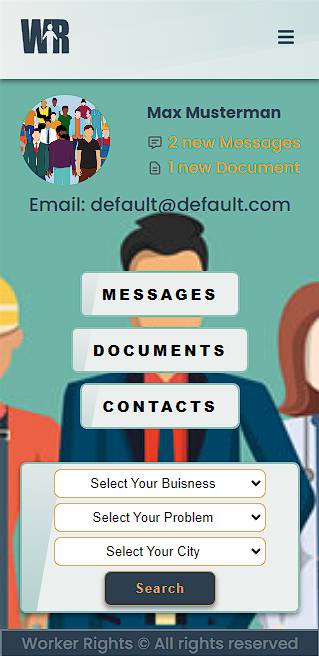

# This team project is an international collaboration via Masterschool

## Content

- [What-is-masterschool](#what-is-masterschool)
- [What is the purpose of this project?](#what-is-the-purpose-of-this-project)
- [What is this app?](#what-is-this-app)
- [How did we make our collaboration work?](#how-did-we-make-our-collaboration-work)
- [Live preview](#live-preview)
- [How to install the app](#how-to-install-the-app)
- [About the team](#about-the-team)

</br>

---

## What is Masterschool?

Masterschool is an online only coding school based in Israel. So far we learned Javascript, CSS, HTML, React, DOM manipulation, async-await functions, debugging, Git, routing and website layouts. Our teachers are industry-leading experts who are currently employed in senior development roles. Every student learns to adapt their studies to their respective timezones.

## What is the purpose of this project?

First and foremost to learn to operate effectively in a team, build collaboration skills and to put git conventions into practice. We were first instructed to create a group of three, which required good communication skills and depended on the social network already built within the school thanks to our own initiative. Once our team was formed we were instructed to build an app together which would tackle a social issue.

## What is this app?

An app called "Workers Rights" which is designed for workers in all sectors to get help if they are suffering from mistreatment at work. The app connects them with the lawyers and unions nearest to them and with the most relevant experience in solving their problem.




## How did we make our collaboration work?

Andy, who is the most competent coder, was our group leader. The three of us already knew each other from working on a Next.js project so we decided to work together on this one. We communicated via Slack and Trello, and had regular Zoom meetings. First we created a mock-up via <a href="https://www.figma.com/file/9xDhEqRp6fD1m4Gq8ErDuK/106-Team-Project-team-library?node-id=421%3A54&t=lFiqQliQfpxSA3VK-0">Figma</a>. Then we created different branches for different components and component versions. Andy managed the branch merging, Firebase authentication, routing, page layout and debugging. Vedran managed the forms, footer, database and the desktop CSS. I (Antonia) managed the navbar and worked with Vedran on the database and desktop CSS.

---

## **Live preview**

## Click here ---->>> **[Worker Rights](https://team-project-wd-106-545e13qov-d-nayte.vercel.app/login?logout=false)**

</br>

---

## How to install the app

Fork or clone this repo and

```
npm install
npm run start
```

### You need also a Firebase account

- addionaly add a Database, storage and Auth to your Firebase
- create a "`.env.local`" file inside the main directory
- copy your firebase credentials there like so:

```js
NEXT_PUBLIC_FIREBASE_API_KEY = your_data;
NEXT_PUBLIC_FIREBASE_AUTH_DOMAIN = your_data;
NEXT_PUBLIC_FIREBASE_PROJECT_ID = ayour_data;
NEXT_PUBLIC_FIREBASE_STORAGEBUCKET = your_data;
NEXT_PUBLIC_FIREBASE_MESSAGIN_SENDER_ID = your_data;
NEXT_PUBLIC_FIREBASE_APP_ID = your_data;
```

---

## About the team

<ul>
    <li><em> @D-Nayte (Andy Schunke)</em> is based in Germany and speaks fluent German and English. He has over ten years of experience in technical operations and is particularly interested in full-stack development roles. As well as leading this our team he has also been commissioned by masterschool to lead a larger team and will soon be teaching within Masterschool. Here is his <a href="https://github.com/D-Nayte">Github</a>, and <a href="https://www.linkedin.com/in/andy-schunke">Linkedin</a></li>
    <li><em> @Vedrandj (Vedran Djokic)</em> is from Yugoslavia and is based in Austria. He speaks fluent Bosnian, German and English. He has worked for Peek & Cloppenburg for over five years as a project manager and has bought his management, timekeeping and communication skills to our team with excellent effect. He is particularly interested in opportunities to learn new skills and as a web developer will always actively learn frameworks and languages outside his job role. Here is his <a href="https://github.com/Vedrandj">Github</a>, and <a href="https://www.linkedin.com/in/vedran-djokic-9ab2851aa/">Linkedin</a></li>
    <li>I, <em> @antoniapisano (Antonia Pisano)</em> am based in England and speak fluent English and Italian. I have over seven years of sales and customer service experience in various roles and have learned that strong teamwork and team bonding leads to the best quality work. I am particularly interested in React developer roles and am always interested in opportunities to improve the speed of my coding and becoming a better debugger. Here is my <a href="https://github.com/antoniapisano">Github</a>, and <a href="https://www.linkedin.com/in/antonia-pisano-423081146/">Linkedin</a></li>
</ul>

## **_[Back](#content)_**

---
